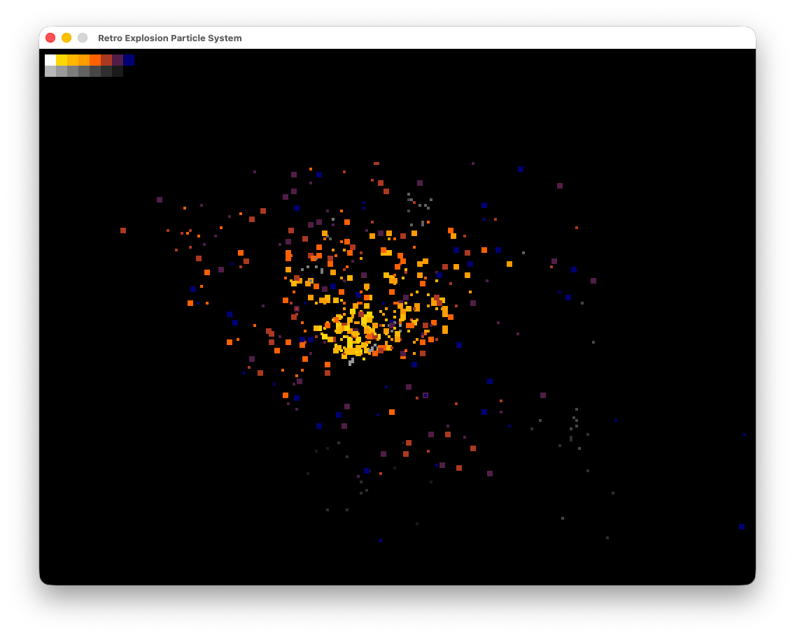

Retro Explosion Particle System
===============================

A particle system playground.



Install:

* SDL3
* pkg-config

Build:

```
cmake -B build -S .
cmake --build build
```

Run:

```
./build/Explosions
```

Then:

* An initial burst will happen
* Click with a mouse button to do a new burst
* Click with a different mouse button to do a different sort of burst
* Single particles will spawn as you move your mouse
* When idle another random burst will happen
* Use mouse wheel to adjust number of particles spewed on clicks

After:

* Alter the particle setup in `main.c`
* Meddle with the configuration in `explosion.h`
